<div align="center">



<br /><br />

**Manage clients, schedule sessions, and close contracts — all in one place.**

<br />

   

<br /><br />

**Part of the [InfoDot Ecosystem](https://github.com/sakhileb/InfoDot)** &nbsp;·&nbsp; `engage.infodot.app`

</div>

---

## What is Dot.Engage?

Dot.Engage is the client relationship and engagement platform in the InfoDot ecosystem. Service businesses manage their entire client lifecycle — from first proposal to signed contract to completed session — in a single, unified workspace.

## Core Features

- Client CRM — profiles, notes, and communication history
- Session scheduling with calendar sync and reminders
- Proposal builder with e-signature acceptance
- Contract management — draft, send, track, and archive
- Real-time chat with clients via Reverb
- Invoicing linked to completed sessions (Dot.Billing integration)
- Progress tracking dashboards per client
- Ecosystem SSO from InfoDot hub

## Domain Models

- **Client** — contact profile with status
- **Session** — scheduled engagement with notes
- **Proposal** — scoped offer with pricing
- **Contract** — signed agreement with versioning

## Tech Stack

| Layer | Technology |
|---|---|
| Framework | Laravel 12 |
| Language | PHP 8.4 |
| Frontend | Livewire 3 · Alpine.js 3 · Tailwind CSS |
| Database | PostgreSQL 16 (shared across ecosystem) |
| Realtime | Laravel Reverb |
| Auth | Laravel Sanctum (InfoDot SSO) |
| AI | Anthropic Claude (`claude-sonnet-4-6`) |
| Storage | AWS S3 / Local (Flysystem) |
| Search | Laravel Scout · Meilisearch |
| Queue | Redis · Laravel Horizon |

## Quick Start

```bash
git clone https://github.com/sakhileb/Dot.Engage.git
cd Dot.Engage
cp .env.example .env
composer install
npm install && npm run build
php artisan key:generate
php artisan migrate
php artisan serve
```

> **Ecosystem SSO:** Set `DB_*` env vars to the shared InfoDot PostgreSQL instance and `APP_URL=https://engage.infodot.app`. Users authenticated through InfoDot gain access automatically via Sanctum handoff tokens.

## Ecosystem

**Dot.Engage** is one of **21 platforms** in the InfoDot ecosystem, connected via shared PostgreSQL and Sanctum SSO. Visit [InfoDot](https://github.com/sakhileb/InfoDot) to explore the full platform map.

## License

MIT © [SK Digital / BluPin Incorporated](https://github.com/sakhileb)
